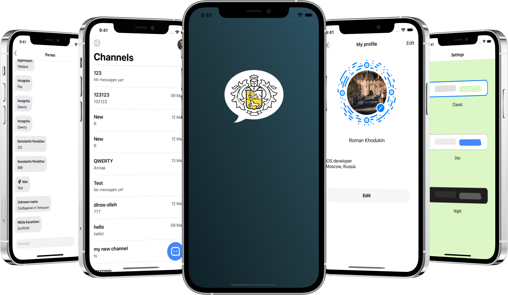

<p align="center">
    
</p>
<p align="center">
  
  
  
  
</p>

<p align="center">
  
</p>


### Installation all dependencies
#### Pods
1. Add Pods (open project directory in terminal)
```
pod install
```
#### Creation Config.xcconfig
1. Create file Config.xcconfig and add there the following
```
PIXABAY_API_KEY = YourAPI
```
where YourAPI is a api key, which you can create in https://pixabay.com/api/docs/

#### Setting configurations of project

1. Open .xcworkspace and go to project editor
2. Navigate to Info tab and assign your config file to debug and release builds

#### Discord Notifier
1. Add fastlane discord_notifier plugin
```
fastlane add_plugin discord_notifier
```
2. Add package
```
brew install libsodium
```
3. Create file .env in fastlane directory and set there a variable
```
DISCORD_WEBHOOK_URL="YourWebhook_url"
```